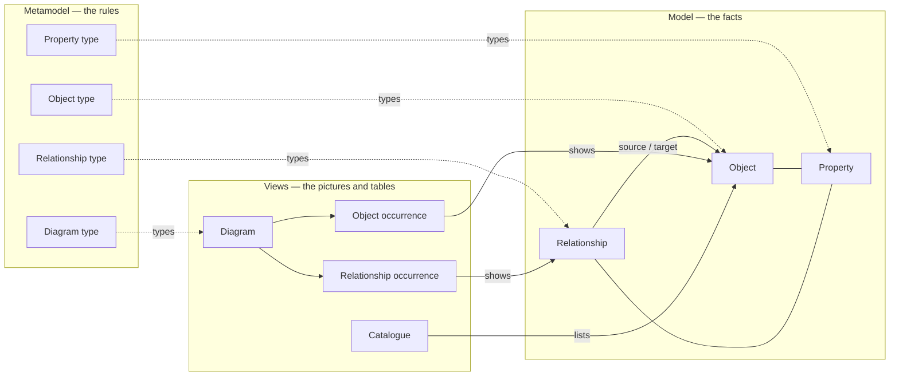

# Model overview

This is the core of the design. Everything else (storage, API, UI) implements what is written here. The machine-checkable version is [05-structures/model.ts](../05-structures/model.ts).

## 1. Three layers

## 2. Vocabulary

| Term | Meaning |
|---|---|
| **Workspace** | A customer account: members, sign-in, billing |
| **Repository** | One shared model: its metamodel, folders, objects, relationships, diagrams, catalogues and scenarios |
| **Folder** | Organises everything in a repository. Every object, diagram and catalogue sits in exactly one folder. Folders carry permissions |
| **Object type** | A kind of thing, e.g. Application, Capability, Process. Defines its properties, symbol and rules |
| **Object** | One thing in the organisation, e.g. *Claims Manager*. Exists once, whatever number of diagrams show it |
| **Relationship type** | A kind of link, e.g. *serves*, *flows to*, *contains*. Defines which object types it may connect |
| **Relationship** | One directed link between two objects: *Claims Manager serves Handle Claim* |
| **Nesting relationship** | A relationship whose type is marked *nesting* (e.g. *contains*, *composed of*). It forms hierarchies, and on diagrams it can be shown by placing one symbol inside another |
| **Semantic kind** | What the engine understands a relationship type to mean: one of 14 built-in kinds (containment, composition, flow, realisation, interaction…). Custom types keep their names and map onto a kind ([semantics](semantics.md)) |
| **Containment** | The semantic kind that is the repository's structure: an object has at most one container and lives in its container's folder. Distinct from **composition** (an intrinsic part) |
| **Category, level** | What kind of thing an object type is (service, information, component…), and how concrete an object is (conceptual, logical, physical, implementation) |
| **Payload** | The objects a flow carries, e.g. *Payment Information* |
| **Interaction** | A communication exchange between two objects; its request and response **messages** are flows inside it |
| **Property type** | A kind of value, e.g. Owner (person), Status (list), Run cost (money) |
| **Property** | A value on an object or relationship: *Status = Active* |
| **Diagram type** | Defines a kind of diagram: allowed object and relationship types, symbols, colour rules, labels, layout, legend, and optional automatic generation |
| **Diagram** | A picture made of occurrences, based on one diagram type |
| **Object occurrence** | A symbol on a diagram showing an object. An object can occur any number of times, on any number of diagrams (including several times on one diagram). Every occurrence points to the same object |
| **Relationship occurrence** | A line between two specific object occurrences showing a relationship, or a nesting shown by placement |
| **Annotation** | Text, a frame or a free shape on a diagram. It is **not** part of the model |
| **Catalogue** | A live, editable table of objects selected by a query, with chosen columns |
| **View** | Umbrella term for diagrams, catalogues, matrices, roadmaps, charts and dashboards |
| **Query** | A saved selection of objects, e.g. "active applications without an owner" |
| **Scenario** | A branch of the repository for designing a future or alternative state. The **baseline** is the main scenario |
| **Change** | One user action: an atomic set of edits, and one undo step |
| **Change request** | A group of changes submitted for review and approval |
| **Rule** | A relationship rule, nesting rule, validation rule or calculation |
| **Package** | A ready-made, versioned metamodel configuration: types, rules, diagram types and exchange-format mappings. Frameworks such as ArchiMate, BPMN or TOGAF are packages, not product features |
| **Automation** | A script that runs in a safe sandbox: manually, on a schedule or when data changes |
| **Panel** | A custom window added to the workbench by an extension |

## 3. The essential rules (enforced by the server)

1. Every object and relationship has exactly one type from the repository's metamodel.
2. Properties can only use property types assigned to the object or relationship type. Values must match the data type.
3. A relationship always connects two existing objects, and its type must allow that pair (or the relationship is flagged, if the rule only warns).
4. Every object is in exactly one folder.
5. Nesting relationships never form a cycle. If a nesting type is marked *single parent*, an object can have at most one parent of that type. *From slice Sem-2:* an object has at most one container across all containment types, and a contained object lives in its container's folder ([semantics §3](semantics.md#3-containment-is-the-repositorys-structure)).
6. An occurrence always points to an existing object or relationship; it holds nothing of its own except layout. A relationship occurrence joins two object occurrences on the same diagram that show the relationship's source and target objects.
7. Deleting an object deletes its relationships and removes all its occurrences. The user sees this impact before confirming.
8. Removing an occurrence from a diagram never deletes the object.
9. Every edit happens inside a change (transaction). There is no other way to write.

## 4. Identity

| Need | Identifier |
|---|---|
| System references, links, history | `id`: one global ID (ULID) per object, relationship, diagram, etc. |
| People and imports | Optional `key` (e.g. `APP-0042`), unique per object type, or the name + folder path |
| Other systems | `externalIds`, e.g. `{ "servicenow": "a1b2c3" }`. A `system: id` pair belongs to at most one live object (and one relationship) |

Names are labels, not identity: how duplicates are prevented, found and merged is in [duplicates-and-identity.md](duplicates-and-identity.md).

## 5. Where to read next

| Topic | Document |
|---|---|
| Objects, relationships, properties, folders, hierarchies | [objects-relationships-properties.md](objects-relationships-properties.md) |
| Types and the metamodel | [metamodel.md](metamodel.md) |
| Diagrams, occurrences, catalogues and other views | [diagrams-and-catalogues.md](diagrams-and-catalogues.md) |
| Scenarios and lifecycle | [scenarios-and-time.md](scenarios-and-time.md) |
| Validation, calculations, derived relationships | [rules-and-calculations.md](rules-and-calculations.md) |
| Semantic kinds, containment, payloads, interactions, tracing | [semantics.md](semantics.md) |
| Glyphs, renditions, style rules, markers, lenses, stencils; administering the rules | [notation-and-metamodel-admin.md](notation-and-metamodel-admin.md)  |
| Duplicates: uniqueness per type, find or create, similarity, merge | [duplicates-and-identity.md](duplicates-and-identity.md) |
| Matrix, list, specification and sequence views; design artifacts (templated documents) | [views-and-design-artifacts.md](views-and-design-artifacts.md) |
