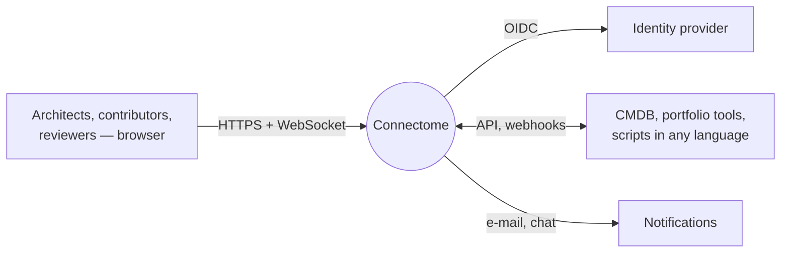
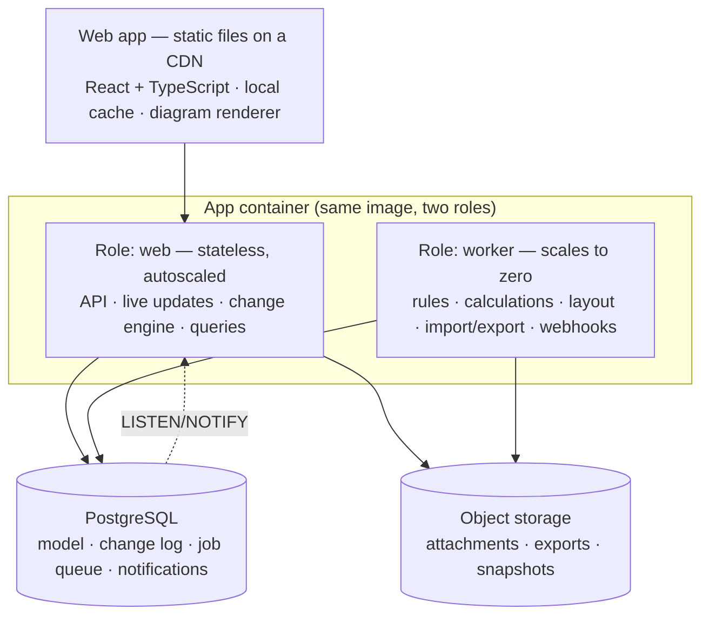

# Architecture

**Goals, in order:**
1. Cloud-based.
2. Cheap to run.
3. Fast for every customer.
4. Portable (the same build can run in a private cloud or on premise, though that isn't a product goal).

## 1. Context

## 2. Containers

**Shape: a modular monolith on PostgreSQL only** ([ADR-002](../06-decisions/ADR-002-modular-monolith.md), [ADR-008](../06-decisions/ADR-008-cost-effective-multi-tenant-cloud.md)). There are three moving parts at launch: one container image, one PostgreSQL database and object storage.

| Part | Responsibility | Cost lever |
|---|---|---|
| Web app | Workbench, local cache, instant edits, diagram rendering | Static files on a CDN: almost free |
| **Web role** | Sign-in, API, live updates (WebSocket), **change engine (the only writer)**, queries | Stateless; scales out on CPU and connections, in to 1 at night |
| **Worker role** | Rules, calculated properties, generated diagrams and layout, imports and exports, webhooks, notifications | The same image with a different start command; **scales to zero** when the job queue is empty |
| **PostgreSQL** | Source of truth, plus: job queue (`SELECT … FOR UPDATE SKIP LOCKED`), live-update fan-out (`LISTEN/NOTIFY`), presence | One managed instance replaces a database, a queue and a pub/sub service |
| Object storage | Files, exports, nightly snapshots | Pennies per GB |

**Added only when measurements demand it** (no design change needed):
- Redis for fan-out and presence above about 5,000 concurrent connections;
- OpenSearch above about 1M objects in a workspace;
- read replicas for heavy reporting.

## 3. Multi-tenancy: pooled by default, isolated on demand

Pooling is the cheapest model. The guards below keep one customer from slowing down another.

| Concern | Design |
|---|---|
| Data isolation | `workspace_id` on every row + PostgreSQL row-level security; cross-tenant tests on every endpoint |
| Fair CPU and IO | Per-workspace rate limits (API, changes, imports); statement timeout (5 s interactive, 60 s jobs); job queue fairness (round-robin by workspace) |
| Write contention | Changes serialise **per repository**, never globally. One busy repository can't block another |
| Connections | A connection pooler (PgBouncer, transaction mode) in front of PostgreSQL |
| Big or regulated customers | **Placement**: a workspace can be moved to its own database (or its own region) by changing one routing entry (`workspace → connection`). Same code, same schema |
| Noisy-neighbour watch | Per-workspace metrics (CPU time, rows read, queue time). Alerts trigger a move to dedicated placement |

**Indicative cost (EU, managed services, list prices, launch scale of about 50 workspaces):**

| Item | Size | ≈ / month |
|---|---|---|
| PostgreSQL (managed, HA) | 2 vCPU, 8 GB, 100 GB | €250–350 |
| Web role | 2 × 1 vCPU / 2 GB containers | €60–90 |
| Worker role | Scales to zero; ~1 vCPU average | €20–40 |
| Object storage + CDN | 50 GB + traffic | €10–20 |
| **Total** | | **≈ €350–500** |

## 4. Portability

The core uses only:
- one container image;
- PostgreSQL 15+;
- S3-compatible object storage;
- an OIDC provider.

The same build therefore runs on any cloud, a private Kubernetes cluster or a single VM (docker-compose). Cloud-specific services are optional adapters (e.g. a managed CDN), never requirements.

## 5. Technology

| Concern | Choice |
|---|---|
| Language | TypeScript (shared model types; one SDK) |
| Frontend | React, Zustand, own SVG/canvas diagram renderer, ELK.js layout in a Web Worker, TanStack Table |
| Backend | Node.js 22, Fastify, Zod, Kysely, pg-boss (PostgreSQL job queue) |
| Database | PostgreSQL 16 (JSONB properties, recursive queries, row-level security) |
| Live updates | WebSocket; fan-out via PostgreSQL `LISTEN/NOTIFY` |
| Search | PostgreSQL full text + trigram |
| Hosting | Containers on a managed container platform (autoscaling, scale to zero for workers); EU region first |

## 6. The edit path

1. The browser applies the edit immediately and sends the change (id, label, edits, base versions).
2. The change engine checks permissions, types and `block` rules, then compares versions ([collaboration](collaboration-and-changes.md)).
3. One database transaction applies the edits, appends to the change log, increments the repository sequence and enqueues follow-up jobs.
4. `NOTIFY` tells every web instance. Each forwards the change to its connected viewers of that repository and scenario. The sender gets a confirmation, or a rejection with reasons.
5. Workers wake up (or start, if scaled to zero) and re-check rules, update calculated properties (as follow-up changes by `system`), refresh generated diagrams and send webhooks.

## 7. Scale targets

| Dimension | Typical | Design limit |
|---|---|---|
| Objects per repository | 20k | 1M |
| Relationships per repository | 40k | 2M |
| Diagrams per repository | 500 | 50k |
| Occurrences per diagram | 50 | 5,000 |
| Concurrent editors per repository | 5 | 200 |

| Interaction (p95) | Budget |
|---|---|
| Own edit visible | 16 ms (optimistic) |
| Edit confirmed | 150 ms |
| Edit visible to others | 300 ms |
| Open a 500-occurrence diagram | 800 ms |
| First 50 catalogue rows from a 200k-object query | 500 ms |
| Search as you type | 150 ms |

## 8. Operations

| Topic | Design |
|---|---|
| Availability | 99.9% |
| Backup | Point-in-time recovery (RPO 5 min, RTO 1 h) + nightly snapshots to object storage |
| Deploys | Rolling, zero downtime; expand → migrate → contract schema changes |
| Observability | One trace per change; per-workspace cost and latency metrics (they also drive placement decisions) |
