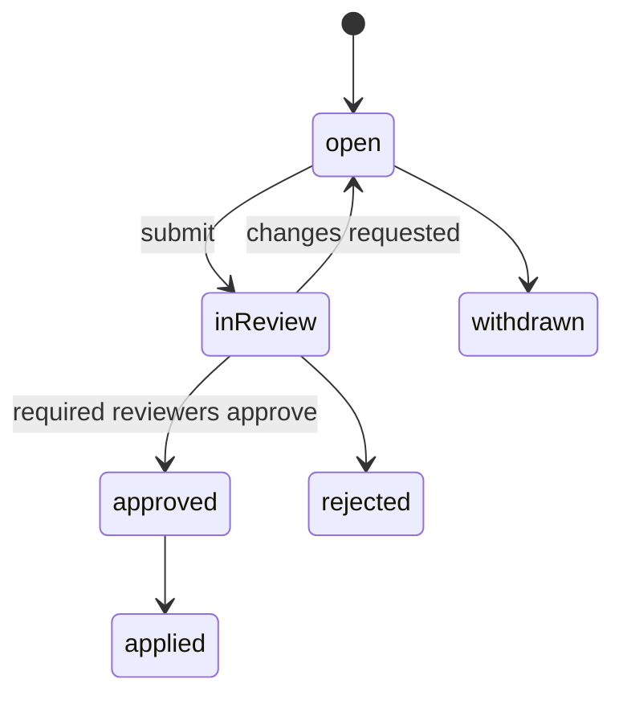

# Collaboration and changes

One mechanism, **changes recorded in a log**, provides:
- live co-editing;
- undo;
- history;
- audit;
- change requests (review and approval).

## 1. Changes

A **change** is one user action: an ordered list of edits, applied atomically.

| Property | Rule |
|---|---|
| Atomic | All edits apply or none do |
| Labelled | "Retire Legacy CRM", "Import applications.xlsx (312 rows)": shown in history and undo |
| Attributed | Who (user, automation or `system`) and where from (ui, api, import, automation, merge, undo) |
| Ordered | Each committed change gets the repository's next sequence number |
| Bounded | At most 10,000 edits. Imports and automations commit in batches grouped in a change request |

Edit types (full list in [changes.ts](../05-structures/changes.ts)):

| Model edits | Diagram edits |
|---|---|
| `createObject`, `setProperties`, `renameObject`, `moveToFolder`, `changeObjectType`, `deleteObject` | `createDiagram`, `updateDiagram`, `deleteDiagram` |
| `createRelationship`, `reconnectRelationship`, `deleteRelationship` | `addObjectOccurrence`, `moveObjectOccurrence`, `styleOccurrence`, `removeOccurrence` |
| `createFolder`, `renameFolder`, `moveFolder`, `deleteFolder` | `addRelationshipOccurrence`, `routeRelationshipOccurrence`, `addAnnotation`, `updateAnnotation` |
| `changeRelationshipType`; *slice Sem-3:* `setPayload` ([semantics §11](../02-model/semantics.md#11-what-changes-in-the-build)) | |

## 2. Live co-editing

```mermaid
sequenceDiagram
  participant A as Browser A
  participant S as Change engine
  participant B as Browser B
  A->>A: apply edit immediately (pending)
  A->>S: submit change {id, scenario, edits, baseVersions}
  S->>S: check permissions, types, rules, versions
  S-->>A: confirmed (seq 1042, new versions)
  S-->>B: broadcast seq 1042
  B->>B: apply; re-apply own pending changes on top
```

- The server decides the order ([ADR-003](../06-decisions/ADR-003-server-ordered-changes.md)). Browsers converge by applying confirmed changes in sequence order.
- After a reconnect, the browser sends its last sequence number and receives what it missed.

### Concurrent edits

Concurrency is checked **per property**. Each object and relationship has a version, and each edit says which version it started from and which fields it touches.

| Situation | Result |
|---|---|
| Nobody else touched the item | Applied |
| Someone else changed **other** properties of the item | Applied. A renames while B sets the owner: both survive |
| Someone else changed the **same** property | Rejected for that edit. The user sees "Dana changed this just now: keep theirs / use mine" |
| The item or its target was deleted meanwhile | Rejected, with an explanation; the browser rolls back its pending edit |
| A `block` rule would be broken | Rejected; the message names the rule |
| Diagram layout (moving, resizing, routing) | Last writer wins, with no prompt. Layout races are harmless |

### Presence

Ephemeral, kept in memory on the web instances and shared between them with PostgreSQL `NOTIFY` (Redis only if scale ever requires it). Never stored:
- who is in the repository, and on which diagram;
- coloured cursors and selections;
- "Dana is editing *Owner*…" hints;
- a brief highlight on items others just changed.

### Connectivity

Short drops are tolerated: changes queue and a "Reconnecting…" banner shows. After 2 minutes offline, editing pauses until the connection returns.

## 3. Undo and history

| Feature | Behaviour |
|---|---|
| Undo / redo | Per user, for that user's own changes in the current scenario. Undo submits a new change built from the stored inverse edits. If someone has since changed the same property, that part is skipped and the user is told |
| Item history | Timeline per object, relationship or diagram: who, when, what changed. "Restore this version" = a new change |
| Activity feed | All changes in the repository, filterable by user, folder, type and source |
| Point in time | Open any diagram or catalogue as it was at a date (read-only) |

## 4. Change requests *(after launch; fully designed now so the change log supports them from day one)*

A **change request** groups changes for review:

| Created by | Example |
|---|---|
| A person | "CRM replacement — interfaces" |
| A scenario | Proposing a scenario opens a change request for its differences |
| An import or automation run | Every run's changes, with its report |
| A governance policy | Edits in protected areas are **held** in a change request instead of applied directly |



The review screen shows:
- a summary;
- the list of differences;
- affected diagrams side by side;
- rule findings (errors block approval);
- comments per item.

### Governance policies

```yaml
- name: Baseline application data needs approval
  scope: { objectTypes: [application], scenario: baseline, properties: ["lifecycle.*", "ownership.*"] }
  mode: hold                 # apply | hold (goes to a change request) | block
  reviewers: [{ group: "Design Authority", required: 1 }, { role: objectOwner }]
- name: Imports are always reviewed
  scope: { source: [import] }
  mode: hold
  reviewers: [{ group: "EA Leads", required: 1 }]
```

Held edits are visible to their author and to reviewers, marked "Pending review". They are not yet part of the baseline.

## 5. Audit

- `change` + `change_log` are append-only. Corrections are new changes; nothing is rewritten.
- Admin actions (roles, policies, exports) are logged as well.
- Audit export (CSV or JSON) requires its own permission.
