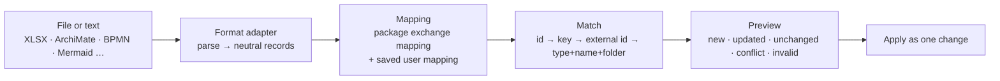

# Import, export and interoperability

Interoperability is a strategic investment. The design makes every format a **pluggable adapter** over one pipeline, so adding a format never touches the core.

**Guarantees for every format:**
- every import is previewed as a list of differences, applied as one labelled change (or change request), and can be undone;
- every export can be imported again.

## 1. One pipeline, many adapters

| Stage | Notes |
|---|---|
| Adapter | Turns a format into **neutral records**: objects, relationships, properties, folders and, optionally, diagram layout. Export adapters do the reverse. Adapters are small and stateless, and each one is tested against a reference file set |
| Mapping | Format names → types, taken from the package's **exchange mapping** ([metamodel](../02-model/metamodel.md#frameworks-are-configuration)), then refined by a user mapping saved per source |
| Match | Re-imports update instead of duplicating |
| Preview | Each row with the old → new value per property; conflicts when someone changed the item since the export |
| Apply | Batched; subject to permissions and, later, governance policies; "Undo import" reverts the change |

## 2. Format roadmap

| Format | Import | Export | When |
|---|---|---|---|
| XLSX / CSV (one sheet per object type + a relationships sheet; hidden ids for safe round trips) | ✓ | ✓ | Launch |
| JSON repository package (metamodel, folders, objects, relationships, diagrams) | ✓ | ✓ | Launch |
| ArchiMate Model Exchange Format | ✓ | ✓ | Launch |
| PNG / SVG of diagrams | — | ✓ | Launch |
| BPMN 2.0 XML (structure + layout) | ✓ | ✓ | Next |
| PDF / PowerPoint | — | ✓ | Next |
| **Markup formats:** Mermaid (flowchart, C4), PlantUML (component, deployment), Graphviz DOT | ✓ | ✓ | Later |
| **Model as code:** YAML/JSON text files for objects and relationships (diffable, reviewable in Git, round-trippable) | ✓ | ✓ | Later |
| Visio (.vsdx), with masters mapped to object types | ✓ | — | Later |

Markup formats map naturally:
- nodes → objects (type from a class or stereotype, or the mapping);
- edges → relationships;
- subgraphs → nesting relationships.

Layout is taken when the format has it, or generated otherwise.

## 3. XLSX round trip (launch)

**Export layout:**
- one sheet per object type, with hidden `_id` and `_version` columns;
- `Key`, `Name` and `Folder` columns;
- one column per property type (list properties get drop-downs);
- a `Relationships` sheet: `Source`, `Type`, `Target`, plus relationship properties.

**Import:**
- columns are matched to property types automatically, then confirmed by the user (saved for next time);
- the steps above follow.

## 4. Standards through packages

Standard formats carry **no special code paths**. The ArchiMate exchange adapter reads the file into neutral records. The repository's package mapping decides the types: ArchiMate's own package, or a mapping onto Essentials. Then the normal pipeline runs.

| Source construct | Becomes |
|---|---|
| Element / relationship | Object / relationship of the mapped type |
| View | Diagram with object and relationship occurrences |
| Nested node | A nesting relationship when a rule allows it; otherwise layout only (reported) |
| Properties | Property values (unknown property definitions are offered for creation, after confirmation) |

## 5. Bulk API

`POST …/bulk` accepts NDJSON upserts matched on key or external ID, with `preview=true` for a dry run. It returns a change id and a report. Scripts, connectors and CI pipelines use this endpoint.
